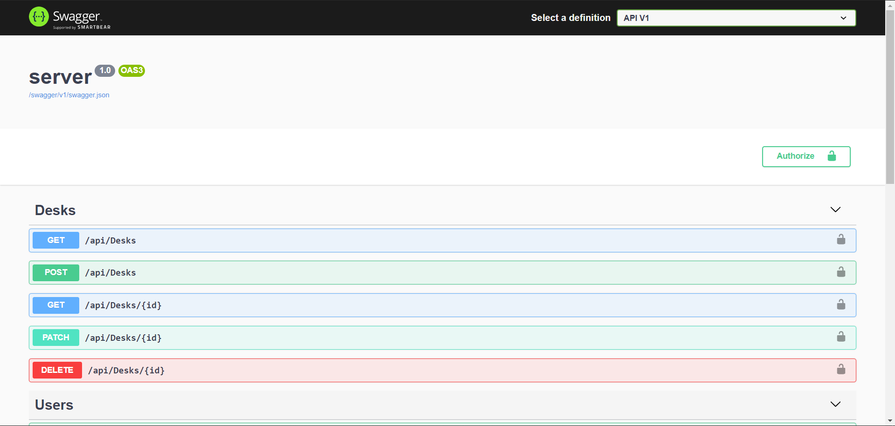

  

  <h2 align="center">YAK</h2>
  <h3 align="center">(Yet Another Kanban)</h2>
  

    <a href="https://github.com/DavidArutiunian/yet-another-kanban/issues">Report Bug</a>
    ·
    <a href="https://github.com/DavidArutiunian/yet-another-kanban/issues">Request Feature</a>
    ·
    <a href="https://docs.google.com/document/d/1BjuOM7VNtBMeSrtzO7ZeV-ecRqKMXukEunjNVVKFFUw/edit?usp=sharing">Technical Requirements</a>
    ·
    <a href="https://documenter.getpostman.com/view/414676/TVYGbHnb">Postman Collection</a>
  

## Swagger

Swagger documentaion is accessible via `{{BASE_URL}}/` address (i.e. `localhost:5000`)

